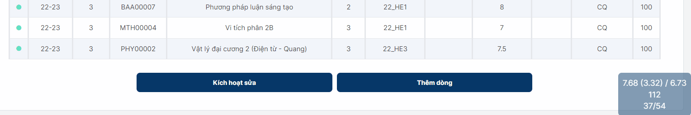

# HCMUS GPA Calculator Bookmarklet Maintenance Project

- [HCMUS GPA Calculator Bookmarklet Maintenance Project](#hcmus-gpa-calculator-bookmarklet-maintenance-project)
  - [Contributions](#contributions)
  - [What is this?](#what-is-this)
  - [List Updates](#list-updates)
    - [Update 5 (-)](#update-5--)
    - [Update 4 (-)](#update-4--)
    - [Update 3 (-)](#update-3--)
    - [Update 2](#update-2)
    - [Update 1](#update-1)
    - [Update 0](#update-0)
        - [List of bugs fixed](#list-of-bugs-fixed)
      - [List of minor modification](#list-of-minor-modification)
  - [Bugs](#bugs)
  - [Guideline](#guideline)
  - [Bugs Report and Suggestions](#bugs-report-and-suggestions)
  - [Licenses and Derivative Works](#licenses-and-derivative-works)

## Contributions

*Thanks **[vkhuy's repository](https://github.com/vkhuy/GPABookmarklet)** for [this finding](#thcsBug). Thanks [Nguyen Quang Thang](https://github.com/thanguyen165) for the 4.0 grade system calculation implementation!*

## What is this?

This is a [forked version](https://github.com/DreamyWanderer/GPABookmarklet_Maintanence) of GPABookmarlet utility, which is created by the execellent [dtrung98's repository](https://github.com/dtrung98/GPABookmarklet). Thank you so much for providing this repository as an open source project!

This project maintained primarily by DreamyWanderer Github user, who is currently a student of VNU-HCMUS. Originally, this extension is developed by dtrung98 Github user (a graduated student) with a simple purpose: **Calculate the GPA for HCMUS student automatically** on their Portal page.

It has been 4 years since the last updated of original repository, and unfortunately I observed a bug comes from Portal itself which this bookmarklet need to deal with. Although they are not computation bugs (which will be more severe), but they can cause some confusion for user. Recently the portal is receiving frequenly updating and the school is also developing a new Portal page, so I think there should be a consistent maintenance for GPABookmarklet to cope with those changings 😢.

Besides that, I also add some minor modifications to this bookmaklet for ~~my~~ user's convenience 😆.

So in short, the goal of this project is:

- Maintenace the extension to **work at least properly** with the **old** Portal page **until that page is no longer work**. There will be **no more** features added to this extension version.
- Develope the extension to **work properly** with the **new** Portal page (bring all funtions that **existed** in old Portal page to the new one) and **add more features** as users requires.

## List Updates

### Update 5 (-)

Áp dụng với GPA Bookmarklet cho [Portal mới](https://student.hcmus.edu.vn/student-affairs):

- Thêm tùy chọn sửa bảng điểm và thêm dòng mới vào bảng điểm (Giúp lập plan tiện hơn). Với các học phần trùng mã: học phần phía sau ưu tiên hơn học phần ở trước. Các giá trị Năm học - Học kỳ khi sửa hiện không có hiệu lực. Nên xóa các dòng mới khi chuyển đổi Năm học - Học kỳ. Nói chung, cẩn thận khi edit để không làm loạn bảng điểm!
- Thêm cột Status để thêm/bỏ học phần vào GPA.
- UI: Thêm Khung hiển thị kết quả GPA mini tại góc phải dưới màn hình để thuận tiện xem kết quả hơn. (Nội dung của Khung thì chắc self-explanatory).
- Minor: Thêm kết quả GPA thang 4.



### Update 4 (-)

Phiên bản dùng cho trang Portal cũ (portal4.hcmus.edu.vn) hiện có thể chạy trên trình duyệt của điện thoại di động và tự động cập nhật các chỉnh sửa mà không cần phải thay đổi bookmark thủ công (tương tự như bản dùng cho trang Portal mới (student.hcmus.edu.vn) ở Update 3). Các bạn nên vào trang hướng dẫn (https://dreamywanderer.github.io/GPABookmarklet_Maintanence/) và thay Bookmark của GPA dùng cho Portal cũ lần cuối nhé.

### Update 3 (-)

Hiện tại, các bạn có thể sử dụng GPA Bookmarklet cho [Portal mới](https://student.hcmus.edu.vn/student-affairs) của trường nhé. Các tính năng hiện có:

- Tính điểm GPA.
- Hiện các bạn có thể chạy tiện ích này với bản Portal mới ngay trên trình duyệt điện thoại nhé.

Trong thời gian tới nếu cần thiết thì mình sẽ implement lại các tính năng hiện có bên bản của Portal cũ để hoạt động trên Portal mới.

Hiện tại trang Portal mới của trường có vẻ đang được update thường xuyên nên sẽ không tránh khỏi nhiều lúc tiện ích bị lỗi. Khi đó mình sẽ tìm cách fix lại. Nếu các bạn dùng bản có tên "Khtn GPA Portal-v2.0" thì không cần cập nhật thủ công nhé, chỉ cần chờ một chút (Chắc vậy!).

Note: Nếu trang Portal mới của trường nâng mức bảo mật của CSP thì phiên bản di động và cập nhật tự động sẽ không hoạt động nữa :>>

### Update 2

Cập nhật lại cách quy đổi hệ 4.0.

Ngoài ra, các đầu điểm chính thức từ Phòng Đào tạo sẽ cập nhật tại trang Portal mới của trường, còn tại trang Poral cũ thì không chắc là cũng sẽ vậy. Do đó các bạn cân nhắc xem điểm bên trang mới nhé. Nếu như cần thiết thì tiện ích này sẽ được chỉnh sửa nhanh để dùng tạm cho trang Portal mới 🥲.

### Update 1

GPA Bookmarklet v 2.0 sẽ được nhập vào Github repo gốc của anh Lê Đình Trung, nên các bạn cũng có thể dùng link cũ (https://dtrung98.github.io/GPABookmarklet/) vẫn được nhé.

Tuy nhiên, do có độ trễ khi hai trang hướng dẫn được nhập lại nên các bản Update có kí hiệu (-) sẽ chỉ áp dụng với đường link (https://dreamywanderer.github.io/GPABookmarklet_Maintanence/) cho tới khi kí hiệu (-) mất.

### Update 0

##### List of bugs fixed

- ~~Deal with a bug comes from Portal, which duplicate some graded courses (GPABookmarklet takes all of duplication for computing).~~

  - Update: This bug has been solved on my portal page, so I cannot implement this fixing anymore 😶.

  <br>

- The bookmarklet loads the page of full courses and calculate on this page. However, this page may be filled with ungraded courses (although those courses have been). Currently this is a problem for students who took part in the last summer semester.

  - Update: Just found and deleted a letter "1" in source code and done! 😀

  

  <br>

- Checkbox for selecting/unselecting a course to be included in GPA does not work.

  - Update: I am not sure whether the author just decide to remove that functionality for some mysterious reason or not. But I found that this feature is quite useful so I just reimplement it carefully such that it will not conflict with normarl grading calculation 🫣.

  

  <br>

#### List of minor modification

- Calculate "**Điểm trung bình học tập**" (includes courses that student has not passed).

  

  <br>

- Add **Letter grade** and **4.0 grade** systems.

  

  

  <br>

- You want to save all courses to PC for further analysing, but do not want to type all of them manually? Just click the button "Lưu danh sách học phần đã chọn" and get them as ```csv``` file.

  

  <br>

- Enabel sorting courses by the "```Trong GPA```" column.

  

  <br>

- Enable searching courses in the table.

  

  <br>

- Enalble "Tính theo học kỳ" option. If you want to calculate for each semester, check this option before go to that semester page and run the GPABookmarklet. Or else unchecking it for calculating otherwise (Bookmarklet remembers this option until you deleted cookies).

  

  <br>

- <a name="thcsBug"></a> Add "Tin học cơ sở" to list of courses that must not to be included in GPA.

## Bugs

- Sometimes enabling the letter/4 grade system causes wrong format. You should re-run the GPABookmarklet to see if that can be fixed.

## Guideline

- Step 1: You must be a HCMUS Student.
- Step 2: Click **[this link](https://dreamywanderer.github.io/GPABookmarklet_Maintanence/)** to know more

````
https://dreamywanderer.github.io/GPABookmarklet_Maintanence/
````

## Bugs Report and Suggestions

Please go to [issues](https://github.com/DreamyWanderer/GPABookmarklet_Maintanence/issues) pages and provide those information. It will be great if you can assign them a suitable label as well!

## Licenses and Derivative Works

You are free to fork and modify [this boormarklet](https://github.com/DreamyWanderer/GPABookmarklet_Maintanence) (as well as other source code file belong to this project) under the GNU GPL 3.0 license. Basically you can do anything, as long as you provide suitable attribution to all previous authors that create the version you are working on.

<p xmlns:cc="http://creativecommons.org/ns#" xmlns:dct="http://purl.org/dc/terms/"><span property="dct:title">Contents, site designs </span> by <span property="cc:attributionName">dtrung98, DreamyWanderer</span> is licensed under <a href="http://creativecommons.org/licenses/by-nc-sa/4.0/?ref=chooser-v1" target="_blank" rel="license noopener noreferrer" style="display:inline-block;">CC BY-NC-SA 4.0</a></p>
