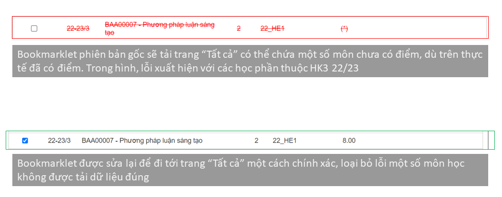
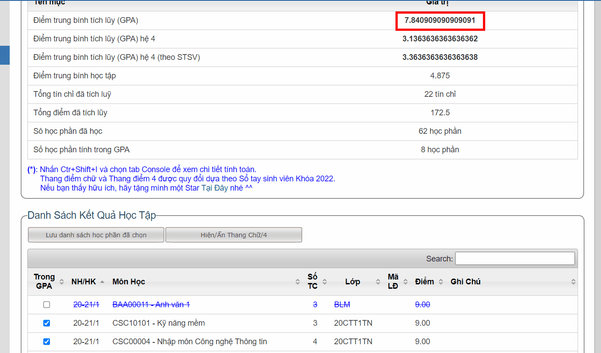
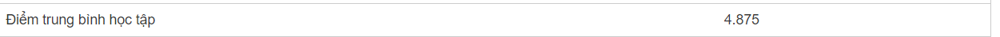
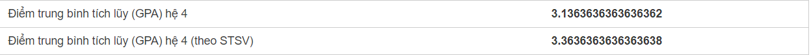
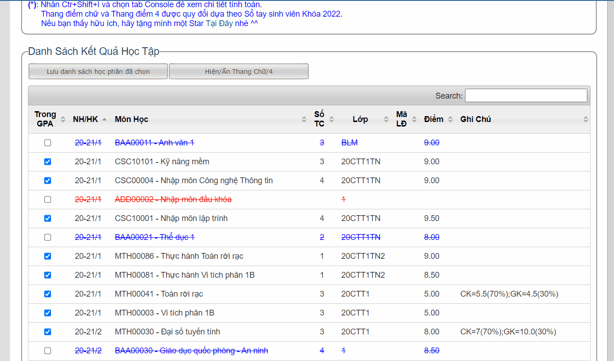
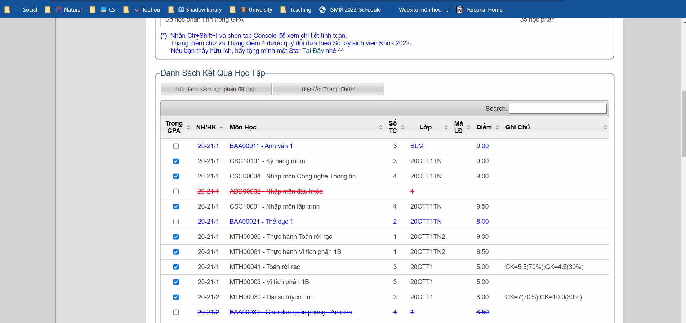
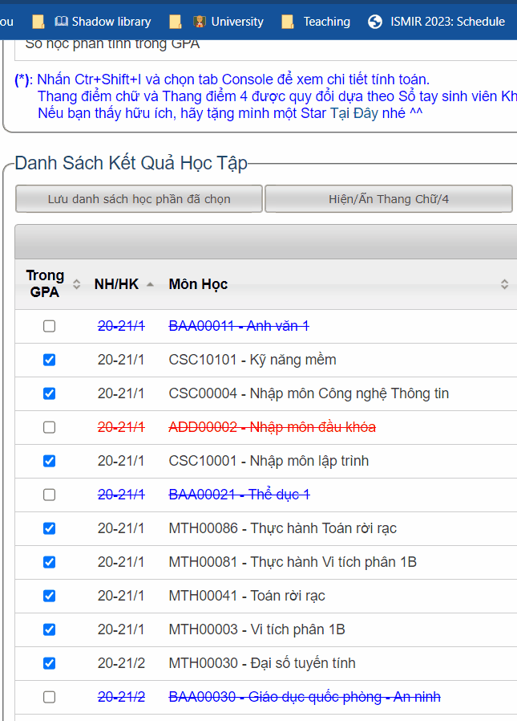
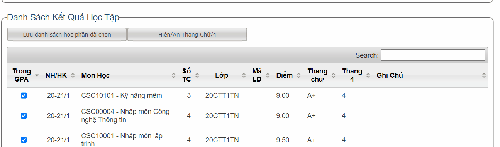
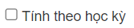

# HCMUS GPA Calculator Bookmarklet (v 2.0.0)

Add a feature to Hcmus Portal, calculate and show your GPA

## What is this?

This is a forked version of GPABookmarlet utility, which is created by [dtrung98's repository](https://github.com/dtrung98/GPABookmarklet).

It has been 4 years since the last updated of original repository, and unfortunately I observed a bug comes from Portal itself which this bookmarklet need to deal with. Although they are not computation bugs (which will be more severe), but they can cause some confusion for user. Recently the portal is receiving frequenly updating, so I think there should be a consistent maintenance for GPABookmarklet to cope with those changings 😢.

Besides that, I also add some minor modifications to this bookmaklet for ~~my~~ user's convenience 😆.

## List of bugs fixed

- ~~Deal with a bug comes from Portal, which duplicate some graded courses (GPABookmarklet takes all of duplication for computing).~~

  - Update: This bug has been solved on my portal page, so I cannot implement this fixing anymore 😶.

  <br>

- The bookmarklet loads the page of full courses and calculate on this page. However, this page may be filled with ungraded courses (although those courses have been). Currently this is a problem for students who took part in the last summer semester.

  - Update: Just found and deleted a letter "1" in source code and done! 😀

  

  <br>

- Checkbox for selecting/unselecting a course to be included in GPA does not work.

  - Update: I am not sure whether the author just decide to remove that functionality for some mysterious reason or not. But I found that this feature is quite useful so I just reimplement it carefully such that it will not conflict with normarl grading calculation 🫣.

  

  <br>

## List of minor modification

- Calculate "**Điểm trung bình học tập**" (includes courses that student has not passed).

  

  <br>

- Add **Letter grade** and **4.0 grade** systems.

  

  

  <br>

- You want to save all courses to PC for further analysing, but do not want to type all of them manually? Just click the button "Lưu danh sách học phần đã chọn" and get them as ```csv``` file.

  

  <br>

- Enabel sorting courses by the "```Trong GPA```" column.

  

  <br>

- Enable searching courses in the table.

  

- Enalble "Tính theo học kỳ" option. If you want to calculate for each semester, check this option before go to that semester page and run the GPABookmarklet. Or else unchecking it for calculating otherwise (Bookmarklet remembers this option until you deleted cookies).

  

- Add "Tin học cơ sở" to list of courses that must not to be included in GPA. Thanks for **[vkhuy's repository](https://github.com/vkhuy/GPABookmarklet)** for this finding.

## Bugs

- Sometimes enabling the letter/4 grade system causes wrong format. You should re-run the GPABookmarklet to see if that can be fixed.

## Future modification

- Let user adds courses as if they have studided them and calculate GPA (it can be useful in case you want to plan what subjects you should learn and what grade you should get for goal GPA).

- Create a version for Tampermonkey, so that the source code can be more organizable and be able to add more features.

## Guideline

- Step 1: You must be a HCMUS Student.
- Step 2: Click **[this link](https://dreamywanderer.github.io/GPABookmarklet_Maintanence/)** to know more

````
https://dreamywanderer.github.io/GPABookmarklet_Maintanence/
````
